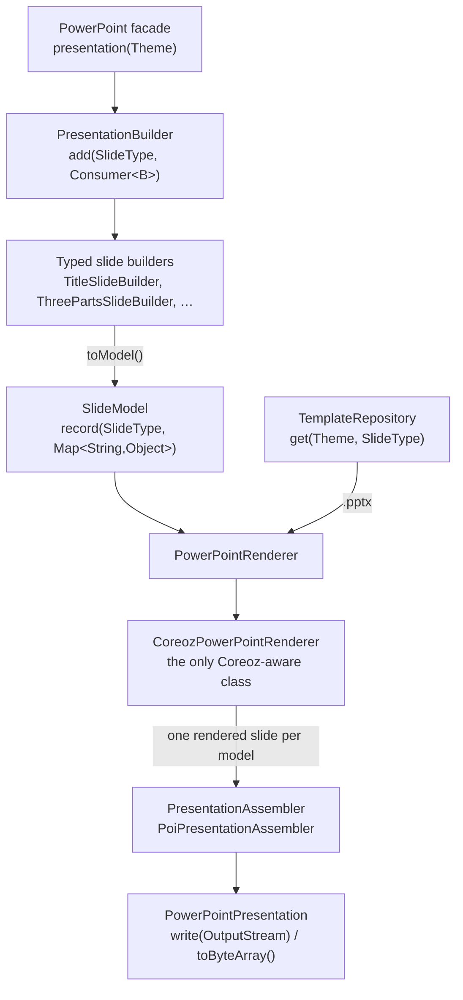

# spring-powerpoint

A Spring Boot 4 starter that generates PowerPoint presentations from `.pptx` templates.

```java
byte[] deck = powerpoint
    .presentation(Theme.CORPORATE)
    .add(SlideType.TITLE, slide -> slide
        .title("Q3 Business Review")
        .subtitle("September 2026"))
    .add(SlideType.THREE_PARTS, slide -> slide
        .title("Key achievements")
        .parts(
            part -> part.title("Revenue").text("+24%"),
            part -> part.title("Customers").text("+18%"),
            part -> part.title("Margin").text("+4 pts")))
    .build()
    .toByteArray();
```

## 1. What the project does

Designers own the design: each slide layout is a real `.pptx` file, authored in PowerPoint, holding
`$/variable/` placeholders. Developers own the content: a fluent, compile-time checked DSL where the slide
type decides which methods exist.

* `SlideType` selects both the template file and the builder API — `SlideType.TITLE` gives a
  `TitleSlideBuilder` (`title`, `subtitle`), `SlideType.THREE_PARTS` gives a `ThreePartsSlideBuilder`
  (`title`, `parts`). Using the wrong method is a compile error, not a runtime surprise.
* `Theme` selects the folder the templates are read from, so the same code produces a corporate, a modern
  or a minimal deck.
* Template variable names (`part0.title`, `left.text`) never appear in application code: they are an
  implementation detail of the builders and of the Coreoz adapter.
* One presentation is rendered per slide, then merged into a single deck with Apache POI — no binary
  concatenation.

No database, no web layer, no REST endpoints: the starter produces bytes and lets the application decide
what to do with them.

## 2. Architecture



| Module | Contains |
| --- | --- |
| `spring-powerpoint-core` | the whole library: DSL, model, template resolution, rendering, assembly. **No Spring dependency.** |
| `spring-powerpoint-spring-boot-autoconfigure` | `PowerPointAutoConfiguration`, `PowerPointProperties` |
| `spring-powerpoint-spring-boot-starter` | pom only: core + autoconfigure + `spring-boot-starter` |
| `example` | Spring Boot application, the three template themes, integration tests |

Package boundaries inside core:

| Package | Role |
| --- | --- |
| `io.github.anoder.powerpoint` | public API: `PowerPoint`, `PresentationBuilder`, `PowerPointPresentation`, `Theme`, `SlideType`, exceptions |
| `io.github.anoder.powerpoint.dsl` | slide builders, `SlideBuilderFactory`, `SlideBuilderRegistry` |
| `io.github.anoder.powerpoint.model` | immutable records passed to the renderer: `SlideModel`, `SlideImage`, `RenderedSlide` |
| `io.github.anoder.powerpoint.template` | `TemplateRepository`, `ClasspathTemplateRepository`, `TemplateFixtureGenerator` |
| `io.github.anoder.powerpoint.render` | `PowerPointRenderer`, `CoreozPowerPointRenderer`, `PresentationAssembler`, `PoiPresentationAssembler` |
| `io.github.anoder.powerpoint.internal` | default facade wiring |
| `com.coreoz.ppt`, `org.apache.poi.ooxml` | vendored template engine, see [§10](#10-how-coreoz-templates-work-internally) |

## 3. Maven dependency

```xml
<dependency>
    <groupId>io.github.a-n-o-d-e-r</groupId>
    <artifactId>spring-powerpoint-spring-boot-starter</artifactId>
    <version>0.1.0-SNAPSHOT</version>
    <type>pom</type>
</dependency>
```

Without Spring Boot, depend on `spring-powerpoint-core` and build the facade by hand:

```java
PowerPoint powerpoint = new DefaultPowerPoint(
    SlideBuilderRegistry.withBuiltIns(),
    new CoreozPowerPointRenderer(new ClasspathTemplateRepository(), new PoiPresentationAssembler()),
    Theme.CORPORATE);
```

The coordinates are meant to be renamed: `io.github.a-n-o-d-e-r` and the version appear in the parent
`pom.xml` (coordinates, `dependencyManagement`) and as the `<parent>` of the four modules — a search and
replace of `io.github.a-n-o-d-e-r` and of `0.1.0-SNAPSHOT` covers it. The Java packages are
`io.github.anoder.*`: a Maven groupId may contain hyphens, a Java package may not, so the two differ by
those hyphens only.

## 4. Spring Boot configuration

```yaml
powerpoint:
  default-theme: corporate          # used by PowerPoint.presentation(); CORPORATE, MODERN or MINIMAL
  templates:
    location: classpath:/powerpoint # root of the template tree
```

Both properties are optional; the values above are the defaults. `default-theme` is bound to the `Theme`
enum, so an unknown value fails at startup.

The auto-configuration contributes these beans, each `@ConditionalOnMissingBean`:
`TemplateRepository`, `PresentationAssembler`, `PowerPointRenderer`, `SlideBuilderRegistry`, `PowerPoint`.

## 5. Template folder structure

```
src/main/resources/powerpoint/
├── corporate/
│   ├── title.pptx
│   ├── section.pptx
│   ├── agenda.pptx
│   ├── three-parts.pptx
│   ├── two-columns.pptx
│   ├── image-text.pptx
│   ├── statement.pptx
│   ├── metrics.pptx
│   ├── timeline.pptx
│   ├── team.pptx
│   ├── quote.pptx
│   ├── chart.pptx
│   ├── full-image.pptx
│   └── conclusion.pptx
├── modern/          (same fourteen files)
└── minimal/         (same fourteen files)
```

The path is `{templates.location}/{theme.folder()}/{slideType.templateName()}.pptx`. A missing file raises
`TemplateNotFoundException`, whose message contains the theme, the slide type and the resolved path.

Each template is a **one-slide** presentation. Where the variables must go is described in
[§10](#10-how-coreoz-templates-work-internally).

The templates of the `example` module are generated by `TemplateFixtureGenerator`, so the repository does
not carry hand-made binaries that nobody can review:

```bash
mvn -pl example exec:java@generate-templates      # rewrites example/src/main/resources/powerpoint
java -cp spring-powerpoint-core/target/classes:… \
    io.github.anoder.powerpoint.template.TemplateFixtureGenerator /path/to/powerpoint
```

They are plain starting points — replace them with real designs; only the variable names matter.

## 6. Available slide types

| `SlideType` | Template file | Builder | Variables used |
| --- | --- | --- | --- |
| `TITLE` | `title.pptx` | `TitleSlideBuilder.title/subtitle` | `$/title/`, `$/subtitle/` |
| `SECTION` | `section.pptx` | `SectionSlideBuilder.title/subtitle` | `$/title/`, `$/subtitle/` |
| `AGENDA` | `agenda.pptx` | `AgendaSlideBuilder.title/items/item` | `$/title/`, `$/item0/` … `$/item5/` |
| `THREE_PARTS` | `three-parts.pptx` | `ThreePartsSlideBuilder.title/parts/part` | `$/title/`, `$/part0.title/`, `$/part0.text/` … `$/part2.text/` |
| `TWO_COLUMNS` | `two-columns.pptx` | `TwoColumnsSlideBuilder.title/left/right` | `$/title/`, `$/left.title/`, `$/left.text/`, `$/right.title/`, `$/right.text/` |
| `IMAGE_TEXT` | `image-text.pptx` | `ImageTextSlideBuilder.title/text/image` | `$/title/`, `$/text/`, `$/image/` |
| `STATEMENT` | `statement.pptx` | `StatementSlideBuilder.statement/attribution` | `$/statement/`, `$/attribution/` |
| `METRICS` | `metrics.pptx` | `MetricsSlideBuilder.title/metrics/metric` | `$/title/`, `$/metric0.value/`, `$/metric0.label/` … `$/metric3.label/` |
| `TIMELINE` | `timeline.pptx` | `TimelineSlideBuilder.title/milestones/milestone` | `$/title/`, `$/milestone0.date/`, `$/milestone0.text/` … `$/milestone4.text/` |
| `TEAM` | `team.pptx` | `TeamSlideBuilder.title/people/person` | `$/title/`, `$/person0.name/`, `$/person0.role/`, `$/person0.photo/` … `$/person3.photo/` |
| `QUOTE` | `quote.pptx` | `QuoteSlideBuilder.quote/author/role` | `$/quote/`, `$/author/`, `$/role/` |
| `CHART` | `chart.pptx` | `ChartSlideBuilder.title/chart/takeaway` | `$/title/`, `$/chart/`, `$/takeaway/` |
| `FULL_IMAGE` | `full-image.pptx` | `FullImageSlideBuilder.image/headline/subheadline` | `$/image/`, `$/headline/`, `$/subheadline/` |
| `CONCLUSION` | `conclusion.pptx` | `ConclusionSlideBuilder.title/subtitle` | `$/title/`, `$/subtitle/` |

The pitch-deck types — `AGENDA`, `STATEMENT`, `METRICS`, `TIMELINE`, `TEAM`, `QUOTE`, `CHART`,
`FULL_IMAGE` — have room for a fixed number of repeated blocks (six agenda items, four metrics, five
milestones, four people). Filling fewer is normal: the leftover texts are emptied, and a leftover image
placeholder (a person with no photo) is removed from the slide.

```java
.add(SlideType.METRICS, slide -> slide
    .title("Traction")
    .metrics(
        metric -> metric.value("$1.2B").label("Annual recurring revenue"),
        metric -> metric.value("+42%").label("Year over year growth")))
.add(SlideType.TEAM, slide -> slide
    .title("Leadership")
    .people(
        person -> person.name("Dana Okonkwo").role("CEO").photo(Path.of("dana.png")),
        person -> person.name("Ravi Menon").role("CTO")))       // no photo: placeholder removed
.add(SlideType.FULL_IMAGE, slide -> slide
    .image(Path.of("foundry.jpg"))
    .headline("The foundry")
    .subheadline("Two hectares of automated biology"))
```

`SlideType` is a final class with typed constants rather than an enum, because a Java enum cannot carry a
type parameter and the builder type is what makes `add(...)` type-safe. It still behaves like one:
`SlideType.values()`, `SlideType.valueOf("THREE_PARTS")` (also accepts `three-parts`), and `toString()`
returns the name.

## 7. Example usage

```java
@Service
public class BusinessReviewService {

    private final PowerPoint powerpoint;

    public BusinessReviewService(PowerPoint powerpoint) {
        this.powerpoint = powerpoint;
    }

    public byte[] generate() {
        return powerpoint
            .presentation(Theme.CORPORATE)
            .add(SlideType.TITLE, slide -> slide
                .title("Q3 Business Review")
                .subtitle("September 2026"))
            .add(SlideType.SECTION, slide -> slide
                .title("Performance")
                .subtitle("Q3 2026"))
            .add(SlideType.THREE_PARTS, slide -> slide
                .title("Key achievements")
                .parts(
                    part -> part.title("Revenue").text("+24%"),
                    part -> part.title("Customers").text("+18%"),
                    part -> part.title("Margin").text("+4 pts")))
            .add(SlideType.CONCLUSION, slide -> slide
                .title("Thank you"))
            .build()
            .toByteArray();
    }
}
```

Images accept `byte[]`, `InputStream` or `Path` and are read immediately:

```java
.add(SlideType.IMAGE_TEXT, slide -> slide
    .title("Our new office")
    .text("Opened in September 2026")
    .image(Path.of("/var/assets/office.jpg")))
```

The result can be streamed instead of buffered:

```java
PowerPointPresentation presentation = powerpoint.presentation().add(…).build();
presentation.write(response.getOutputStream());
presentation.write(Path.of("target/q3-review.pptx"));
```

`powerpoint.presentation()` uses the configured `powerpoint.default-theme`;
`powerpoint.presentation(Theme.MODERN)` overrides it. A `PowerPointPresentation` is immutable, so it can be
cached or shared.

Run the shipped example:

```bash
mvn -pl example spring-boot:run     # writes example/target/q3-review.pptx
```

## 8. How to create a new theme

1. Add a constant to `Theme`, with the folder name: `PARTNER("partner")`.
2. Create `{templates.location}/partner/` and put one `.pptx` file per slide type in it.
3. Use it: `powerpoint.presentation(Theme.PARTNER)`, or set `powerpoint.default-theme: partner`.

Nothing else changes: template resolution is `theme.folder()` + `slideType.templateName()`.

## 9. How to create a new slide type

Three steps, all in the application — the library does not need to be modified.

```java
// 1. the builder: extend AbstractSlideBuilder to get the variable map and toModel()
public final class PricingSlideBuilder extends AbstractSlideBuilder<PricingSlideBuilder> {

    public PricingSlideBuilder() {
        super(SlideTypes.PRICING);
    }

    public PricingSlideBuilder plan(String plan) {
        put("plan", plan);            // -> $/plan/ in the template
        return this;
    }

    public PricingSlideBuilder price(String price) {
        put("price", price);          // -> $/price/
        return this;
    }
}

// 2. the slide type: the template file name, without the .pptx extension
public final class SlideTypes {
    public static final SlideType<PricingSlideBuilder> PRICING = SlideType.of("PRICING", "pricing");
}

// 3. the factory bean: the registry picks up every SlideBuilderFactory bean
@Bean
SlideBuilderFactory<PricingSlideBuilder> pricingSlideBuilderFactory() {
    return new DefaultSlideBuilderFactory<>(SlideTypes.PRICING, PricingSlideBuilder::new);
}
```

Add `pricing.pptx` to every theme folder, then
`add(SlideTypes.PRICING, slide -> slide.plan("…").price("…"))` is available and type-checked. Declaring a factory for a built-in type replaces the built-in builder; asking
for a type with no factory raises `UnsupportedSlideTypeException`, listing the registered types.

## 10. How Coreoz templates work internally

The engine is [Coreoz PPT-Templates](https://github.com/Coreoz/PPT-Templates). Its variable syntax is
`$/name/`, and how a variable is declared depends on what it replaces:

| Replacement | How the variable is declared in PowerPoint |
| --- | --- |
| text | typed inside the text of a shape: `$/title/`, possibly with surrounding text |
| image | **the hyperlink of the placeholder picture** points to `$/image/` |
| hiding a shape, styling | also carried by the shape hyperlink |

Inserting a picture and setting its hyperlink to `$/image/` is unusual, but that is the mechanism: a
hyperlink is the only shape metadata PowerPoint lets a designer edit freely. See
`TemplateFixtureGenerator` for the same thing expressed with POI.

`CoreozPowerPointRenderer` is the only class that knows any of this. It scans the template for declared
variables, translates the `SlideModel` values into a `PptMapper` (`String`/`Number` → `text`, `SlideImage` →
`image`), calls `PptTemplates.processPpt`, and hands the rendered one-slide deck to the assembler. The
reconciliation is deliberate and works in both directions:

* a value whose variable does not exist in the template → `InvalidSlideException`, listing the variables the
  template does declare;
* a template variable with no value → logged at `WARN` and neutralised, so an unfinished slide never shows
  `$/subtitle/` to the reader: a text variable becomes an empty text, and a shape declaring an image
  variable is removed rather than left showing its placeholder;
* a variable that somehow survived rendering → `PowerPointRenderingException`.

Every message carries the theme, the slide type and the template path.

`PoiPresentationAssembler` then merges the rendered slides: the first one becomes the base deck, so its
theme, masters and layouts are the ones of the result, and the other slides are copied in with
`XSLFSlide.importContent`. Copied slides are attached to the base layout whose name matches, else to the
first layout — which is why templates should use explicit text boxes rather than layout placeholders: the
formatting then travels with the shapes.

### Vendored engine

`com.coreoz:ppt-templates:1.0.1` (the only release, from 2017) is compiled against
`org.apache.poi.POIXMLDocumentPart`, which Apache POI 4 moved to `org.apache.poi.ooxml`. It therefore cannot
run on POI 5, and the POI 5 compatible code on `master` was never released. Rather than depend on a
snapshot, this project vendors those sources into `spring-powerpoint-core`
(`com/coreoz/ppt/*.java`, `org/apache/poi/ooxml/PptPoiBridge.java`, Apache-2.0, commit
`fb8b7386a9ad7dce9e139f4a6839c3037a142803`), with Lombok replaced by plain Java. See `NOTICE`.

This is exactly the isolation the architecture asks for: the incompatibility stops at the adapter, and the
public API never mentions Coreoz.

## 11. How to replace the renderer/repository

Declare your own bean; the matching auto-configured one steps aside.

```java
@Bean
TemplateRepository templateRepository() {                 // templates from the file system
    return new FileSystemTemplateRepository(Path.of("/etc/decks"));
}

@Bean
PowerPointRenderer powerPointRenderer(TemplateRepository templates, PresentationAssembler assembler) {
    return new MyOwnRenderer(templates, assembler);       // another template engine altogether
}
```

`TemplateRepository` has two methods — `get(Theme, SlideType)` returning the `.pptx` stream, and
`describe(Theme, SlideType)` returning the location to quote in error messages. `PowerPointRenderer` and
`PresentationAssembler` mention no template engine either, so replacing them is a matter of implementing
two small interfaces.

## 12. Running tests

```bash
export JAVA_HOME=~/.sdkman/candidates/java/25-tem     # any JDK 25
mvn test
```

What is covered:

* template resolution, including the resolved paths and the `TemplateNotFoundException` message;
* the DSL, asserting the internal variable names produced by every builder — the names the public API hides;
* real rendering: the tests generate the template tree, render several slide types, reopen the result with
  `XMLSlideShow` and assert the slide count, the texts and that no `$/…/` is left;
* the auto-configuration, with `ApplicationContextRunner`: default beans, property binding, and replacement
  of a bean or of a built-in slide builder;
* the example application, with `@SpringBootTest` injecting `PowerPoint`.

## 13. Building the project

```bash
export JAVA_HOME=~/.sdkman/candidates/java/25-tem
mvn clean install
```

Requires JDK 25 (`maven.compiler.release=25`) and Maven 3.9+. If `mvn` itself runs on an older JDK, the
`JAVA_HOME` override above is what makes the build use 25. Dependency versions — Spring Boot 4.1.0, POI
5.5.1 — are properties of the parent `pom.xml`.

### Limitations

* Merging keeps the theme, masters and layouts of the **first** slide's template. Designs that rely on
  per-slide masters within one deck are flattened onto the first template's master; use explicit text boxes
  in the templates.
* A template must contain a single slide; extra slides in a template are rendered as-is and merged.
* Presentations are held in memory (`byte[]`); very large decks with many images are limited by heap.
* Reading a presentation back is done through a temporary file, because POI applies its zip bomb ratio check
  only to stream-based reads and pictures with large flat areas legitimately exceed that ratio.
* The vendored `PptPoiBridge` shares the `org.apache.poi.ooxml` package to reach a `protected` POI method:
  the library works on the class path, not as a JPMS module.
